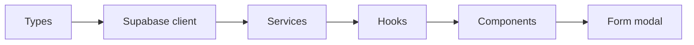

# Job Tracker — Architecture & Plan

As of Sep 24, 2026 · Vasilis Apostolou

## Overview & goals

A personal job tracker built as a learning project: the goal is clean, explainable architecture, not just a working app.

- Track job applications through a status pipeline, from wishlist to offer.
- Practise a strict layered frontend architecture I can defend in interviews.
- Serve as a portfolio piece for mid-level React roles in Limassol, alongside my existing Next.js project.

## Framework decision: React + Vite

The app is built as a React + Vite single-page app, not Next.js.

- **No need for SSR or SEO.** It's a private dashboard behind a login, so there's nothing to pre-render or index.
- **Portfolio range.** My Destiny 2 OST app and the easyMarkets migration already cover Next.js; this shows core React.
- **Cleaner layering.** In a SPA, data flows one way through the layers. Next.js Server Components split fetching across server and client, which adds a second lesson.
- **Supabase is the backend.** Auth, database and security live there, so a Next.js server would sit mostly idle.
- **Upgrade path.** Migrating one feature to Next.js later makes a good interview story.

### Market check (LinkedIn, Limassol/Cyprus)

Every sampled listing required React; Next.js appeared alongside it in 4 of 9, and as a core requirement in only 3.

| Company | Role | React | Next.js |
| --- | --- | --- | --- |
| EY | Junior React Front-end Developer | Yes | — |
| Revolut | Frontend Software Engineer | Yes | — |
| Revolut | Software Engineer (Web), mid-level | Yes | — |
| TradingView | Senior Frontend Developer | Yes | — |
| Mayflower | Senior Frontend Developer | Yes | — |
| Xenith | Senior Software Engineer, Frontend | Yes | Core |
| EMBIO Diagnostics | Frontend Software Engineer (Mid) | Yes | Core |
| IC | Senior Frontend Developer | Yes | Core |
| Digital Expo | Frontend Developer (React) | Yes | Nice-to-have |

Small sample (9 descriptions), limited by LinkedIn rate limits. Headline counts (373 for React, 358 for Next.js) are unreliable because LinkedIn's keyword matching is loose. Source: [LinkedIn Jobs, React in Limassol](https://www.linkedin.com/jobs/search/?keywords=React&location=Limassol%2C%20Cyprus).

## Stack & libraries

Every choice below is decided.

| Concern | Choice | Why |
| --- | --- | --- |
| Build / dev | Vite + React + TypeScript | Fast dev server, a plain SPA, strict types |
| Styling | Tailwind CSS v4 | `@tailwindcss/vite` plugin, `@import "tailwindcss"`, no config files |
| Backend | Supabase, hosted project (Postgres, Auth, RLS) | Database, auth and security without a custom server |
| Auth | Supabase Auth: email/password + Google OAuth | Google needs redirect URLs for localhost and the Netlify domain |
| Server state | TanStack Query | Caching, refetching, optimistic updates without hand-written `useEffect` |
| Forms | react-hook-form + Zod | One Zod schema gives both validation and TS types |
| Routing | React Router | Login, dashboard and a protected-route wrapper |
| Client state | React Context (auth session only) | Server state lives in TanStack Query, so no Redux or Zustand |
| Testing | Vitest + React Testing Library | Runs on Vite's config; tests components the way users use them |
| Hosting | Netlify | Needs a `/* /index.html 200` redirect so React Router routes work on refresh |

Rule of thumb: data from Supabase is **server state**; things like whether the modal is open are **client state**. Keeping them apart removes most of the need for a state library.

## MVP scope

v1 stays small so the architecture stays the focus.

**In v1**

- Auth: sign up, log in, log out with email/password or Google (Supabase Auth).
- Applications CRUD: company, role, status, date applied, job URL, location, salary range (min/max in EUR), notes.
- Status pipeline: Wishlist → Applied → Interviewing → Offer → Rejected / Withdrawn / Ghosted.
- List view with filtering by status and sorting by date.
- Create and edit through a modal form, not a separate route.

**Later (v2+)**

- Status timeline per application, from the events table.
- Contacts and interview rounds.
- Kanban board with drag-and-drop between statuses.
- Stats, such as response rate and average days to first reply.

## Data model

Two tables: `applications` holds the current state, and `application_events` records every status change.

```sql
create type application_status as enum
  ('wishlist', 'applied', 'interviewing', 'offer', 'rejected', 'withdrawn', 'ghosted');

create table applications (
  id          uuid primary key default gen_random_uuid(),
  user_id     uuid not null references auth.users on delete cascade,
  company     text not null,
  role        text not null,
  status      application_status not null default 'applied',
  applied_at  date,
  job_url     text,
  location    text,
  salary_min  int,  -- whole euros (EUR)
  salary_max  int,
  notes       text,
  created_at  timestamptz not null default now(),
  updated_at  timestamptz not null default now()
);

create table application_events (
  id              uuid primary key default gen_random_uuid(),
  application_id  uuid not null references applications on delete cascade,
  from_status     application_status,
  to_status       application_status not null,
  changed_at      timestamptz not null default now()
);
```

- **Why an events table from day one:** `status` says where a job is now; events say how it got there. Adding it later leaves old data without history.
- **Trigger:** a Postgres trigger on `applications` inserts an event whenever `status` changes, so the frontend never has to remember.
- **Security:** RLS on every table with `user_id = auth.uid()`. This is the real security boundary; frontend checks are only UX.
- **Migrations:** schema lives in versioned SQL migration files, not clicks in the dashboard.

## Frontend architecture

Each layer depends only on the layer below it; components never import Supabase.



Read left to right: each box may only import from boxes to its left.

```
src/
  types/
    database.types.ts        # generated: supabase gen types typescript
    application.ts           # domain types: Application, ApplicationStatus
  lib/
    supabase.ts              # single client instance
  services/
    applications.service.ts  # the only place that calls supabase.from(...)
  hooks/
    useApplications.ts       # wraps services; owns loading, error, cache
  components/
    ApplicationList.tsx, ApplicationCard.tsx, StatusBadge.tsx, ApplicationFormModal.tsx
  pages/
    LoginPage.tsx, DashboardPage.tsx
```

Illustrative pattern only (shape of each layer, not the finished implementation):

```ts
// services: pure data access, no React
export async function getApplications(): Promise<Application[]> {
  const { data, error } = await supabase.from('applications').select('*')
  if (error) throw error
  return data.map(toApplication) // DB row -> domain type
}

// hooks: React-aware, no Supabase import
export const useApplications = () =>
  useQuery({ queryKey: ['applications'], queryFn: getApplications })
```

The `toApplication` mapper keeps database column names (`applied_at`) out of components, which use domain names (`appliedAt`).

## Build order

Build bottom-up, following the layers, so each step has something real to sit on.

1. Hosted Supabase project: enum, tables, RLS policies and status trigger, as a migration file.
2. Vite project with Vitest + React Testing Library configured; generate TypeScript types; create the Supabase client.
3. Auth: session context, email/password login, Google OAuth, protected route.
4. Applications service, then TanStack Query hooks, each with tests.
5. List view, then the form modal (create and edit), then delete.
6. Filtering by status and sorting by date.
7. Deploy to Netlify: env vars, SPA redirect, Google OAuth redirect URL.
8. v2 features, one at a time.

## Decisions before coding

All seven open questions are settled; the sections above reflect them.

| Question | Decision |
| --- | --- |
| Server state | TanStack Query from day one |
| Status list | Add Ghosted |
| Salary | `salary_min` / `salary_max` as integers, in EUR |
| Auth | Email/password and Google sign-in |
| Dev environment | Hosted Supabase project, no local Docker stack |
| Testing | Vitest + React Testing Library in v1 |
| Deploy | Netlify |
